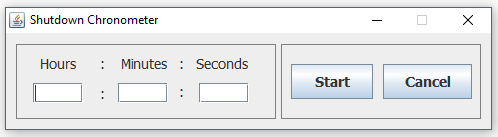

# This is a project to schedule the time to your computer to shutdown.

## Requirements

This project needs the Java 7 onwards.

## Introduciont

Using the Shutdown-Chronometer you can shedule in hours. minutes or seconds to when you machine has to shutdown.

It works for Windows and Linux.